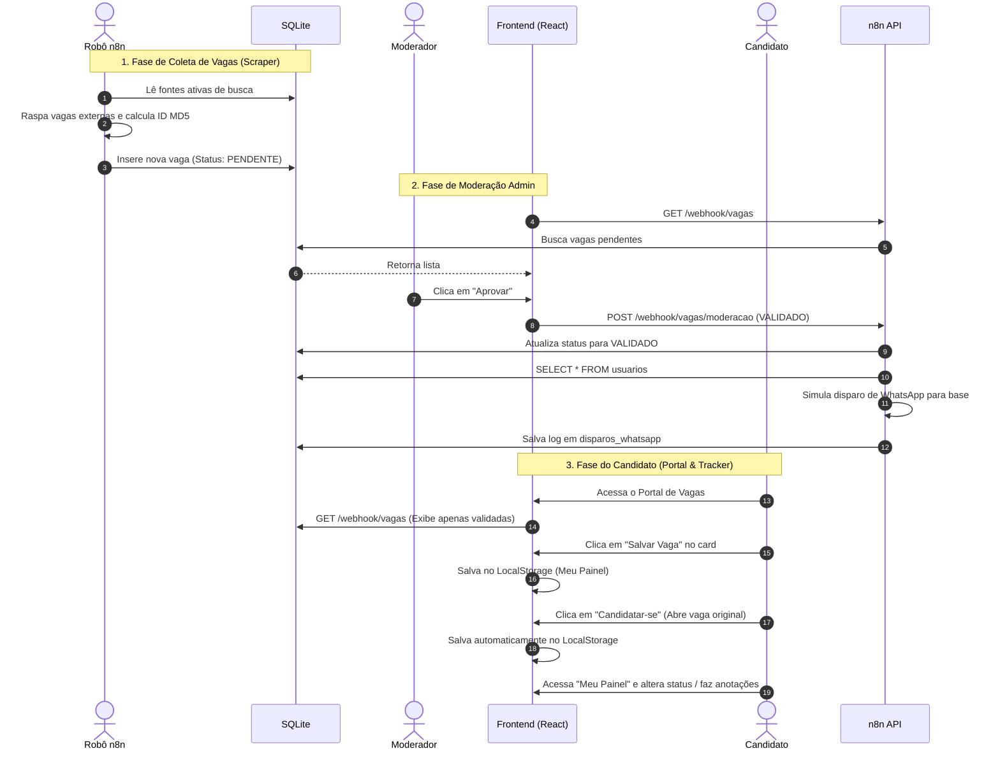

# Documento de Arquitetura do Projeto — JAB (Portal de Vagas e Automação de Jovem Aprendiz)

Este documento descreve a arquitetura técnica, o fluxo de dados e a infraestrutura integrada do Portal JAB. Ele serve como o guia central do sistema para acompanhar o desenvolvimento das três camadas **P.D.S. (Produto, Dados e Serviços)** de forma estruturada.

---

## 🏛️ Visão Geral da Arquitetura (Modelo P.D.S.)

O JAB é estruturado sob o padrão arquitetural de três camadas, permitindo que a interface do usuário (Produto), o banco de dados (Dados) e as automações (Serviços) atuem de forma desacoplada e eficiente.

```mermaid
graph TD
    subgraph Camada de Produto (Frontend)
        A[Navegador do Candidato] <--> B[Vite + React SPA]
        A <--> |Tracker LocalStorage| LS[(LocalStorage Browser)]
    end

    subgraph Camada de Serviços (Automação n8n)
        C[jab-n8n Container] <--> D[Webhook API]
        C <--> E[Scraper Workflow]
        C <--> F[Cleanup Workflow]
    end

    subgraph Camada de Dados (Persistência)
        G[(SQLite: jab.sqlite)] <--> |Volume Compartilhado| C
    end

    %% Conexões
    B <--> |Requisições HTTP / Webhooks| D
    E --> |Coleta e Insere Vagas| G
    F --> |Remove Expiradas > 90 dias| G
```

---

## 💻 1. Camada de Produto (Frontend)

Desenvolvido em **Vite + React + TypeScript + CSS Vanilla**, focado em alta velocidade de carregamento, sem Cumulative Layout Shift (CLS) para maximizar a receita de anúncios, e design 100% responsivo.

*   **Portal de Vagas (`App.tsx` & `JobCard.tsx`)**: O portal consome a lista de vagas da API do n8n. Ele exibe apenas vagas válidas com busca por termo/localidade e placeholders integrados para Google AdSense.
*   **Página Detalhada (`JobDetail.tsx`)**: Exibição da descrição completa da vaga em tela inteira, otimizando o carregamento de novos anúncios estáticos do AdSense (header, sidebar e inline).
*   **Comece por Aqui (`Guide.tsx`)**: Mini curso em 8 slides dinâmicos. Possui quizzes para validar passos e um sistema de **desbloqueio sucessivo (Linear Progress)** que libera as abas seguintes após a conclusão do nível anterior.
*   **Meu Painel / Área do Candidato (`CandidateArea.tsx`)**: Painel de controle privado do jovem. Permite atualizar o status de suas candidaturas (Salva, Candidatado, Entrevista, Aprovado, Reprovado) e salvar anotações de entrevistas.
*   **Painel Administrativo (`App.tsx` & `AdminJobCard.tsx`)**: Área onde o moderador visualiza a fila de vagas pendentes coletadas pelo robô e as aprova (`VALIDADO`) ou rejeita (`REJEITADO`).
*   **Menu Responsivo (`Header.tsx`)**: Cabeçalho adaptativo que se transforma em menu hamburguer móvel com animações nativas em CSS e fechamento automático ao navegar.

---

## 📊 2. Camada de Dados (Persistência)

Os dados no JAB são divididos entre **Banco de Dados Central** (para triagem geral e alertas) e **Cache Local do Browser** (para controle privado do candidato).

### 2.1. Banco de Dados SQLite (`data/jab.sqlite`)
Banco de dados relacional leve compartilhado via Docker Volume.
*   **Tabela `vagas`**: Armazena as vagas raspadas e seus status de moderação (`PENDENTE`, `VALIDADO`, `REJEITADO`).
*   **Tabela `fontes_busca`**: Cadastro das URLs e portais que o robô do n8n deve monitorar.
*   **Tabela `usuarios`**: Registro de nome e telefone dos candidatos cadastrados para alertas de vagas.
*   **Tabela `disparos_whatsapp`**: Log de disparos de mensagens simuladas feitas para a base sempre que uma vaga é validada.

### 2.2. Browser LocalStorage
*   **Chave `'jab_candidate_applications'`**: Salva a lista de vagas salvas pelo usuário no "Meu Painel", seus status de candidatura particulares e anotações. Isso assegura privacidade absoluta para o usuário e velocidade de carregamento instantânea (sem custos de banco de dados no servidor).
*   **Chave `'jab_jobs'`**: Atua como cache offline das vagas no frontend se o servidor do n8n estiver indisponível.

---

## ⚙️ 3. Camada de Serviços (Automação n8n)

O **n8n** atua como o backend central da aplicação, sendo o robô de coleta e o servidor de API da aplicação.

*   **Workflow de API (`n8n_api_workflow.json`)**:
    *   `GET /webhook/vagas` ➔ Retorna as vagas ativas do SQLite ordenadas por descoberta.
    *   `POST /webhook/usuarios` ➔ Cadastra candidatos na tabela `usuarios`.
    *   `POST /webhook/vagas/moderacao` ➔ Atualiza status da vaga no SQLite. Caso a vaga seja aprovada (`VALIDADO`), consulta a tabela de usuários e realiza o disparo de alertas registrando o log na tabela `disparos_whatsapp`.
*   **Workflow de Scraping (`n8n_scraper_workflow.json`)**:
    *   Roda em loop agendado (cron). Lê a tabela `fontes_busca` no SQLite, requisita o HTML de cada fonte, faz o parse de vagas que contenham o termo "aprendiz", gera um hash MD5 único da URL (ID prevenindo duplicidade) e insere a vaga com status `PENDENTE` no SQLite.
*   **Workflow de Limpeza (`n8n_cleanup_workflow.json`)**:
    *   Gatilho diário automático. Deleta do banco de dados SQLite todas as vagas com mais de 90 dias com base no campo `data_descoberta`.

---

## 🗂️ Estrutura de Diretórios do Workspace

```text
JAB/
├── data/                       # Camada de Dados (SQLite)
│   ├── jab.sqlite              # Banco de dados SQLite ativo
│   └── jab_schema.sql          # Script SQL de tabelas e sementes (mock)
├── services/                   # Camada de Serviços (n8n Workflows)
│   └── n8n/
│       ├── n8n_api_workflow.json      # API de Webhooks
│       ├── n8n_scraper_workflow.json  # Scraper de vagas
│       └── n8n_cleanup_workflow.json  # Limpeza de expiradas
├── src/                        # Camada de Produto (Vite + React Frontend)
│   ├── components/
│   │   ├── Header.tsx          # Menu Hamburguer Responsivo
│   │   ├── JobCard.tsx         # Card de Vagas do Candidato (com salvamento)
│   │   ├── AdminJobCard.tsx    # Card de Vagas do Admin
│   │   ├── JobDetail.tsx       # Página dedicada da vaga com AdSense
│   │   ├── Guide.tsx           # Guia Comece por Aqui (Slides, Quizzes, Abas)
│   │   ├── CandidateArea.tsx   # Meu Painel (Tracker & Notas do candidato)
│   │   └── AdBlock.tsx         # Placeholder AdSense anti-CLS
│   ├── App.tsx                 # Core Engine, Rotas e Handlers de API
│   └── index.css               # Design System de CSS Vanilla
├── Dockerfile                  # Build isolado da imagem do frontend
├── docker-compose.yml          # Orquestração do Frontend e do n8n no Docker
└── ARCHITECTURE.md             # Este documento
```

---

## 🔄 Fluxo Completo do Sistema (Ponta a Ponta)



---

## 🛠️ Comandos de Suporte e Desenvolvimento Local

Para operar esta infraestrutura localmente, acesse a raiz do projeto e execute no terminal:

*   **Iniciar todo o ambiente integrado**:
    ```bash
    docker-compose up -d
    ```
*   **Parar o ambiente**:
    ```bash
    docker-compose down
    ```
*   **Reconstruir e aplicar novos pacotes/configurações**:
    ```bash
    docker-compose up -d --build
    ```
*   **Verificar logs dos containers**:
    ```bash
    docker-compose logs -f
    ```
*   **Acessar a aplicação React**: `http://localhost:5173`
*   **Acessar o painel n8n**: `http://localhost:5678` (Credencial SQLite: arquivo `/data/jab.sqlite`)
