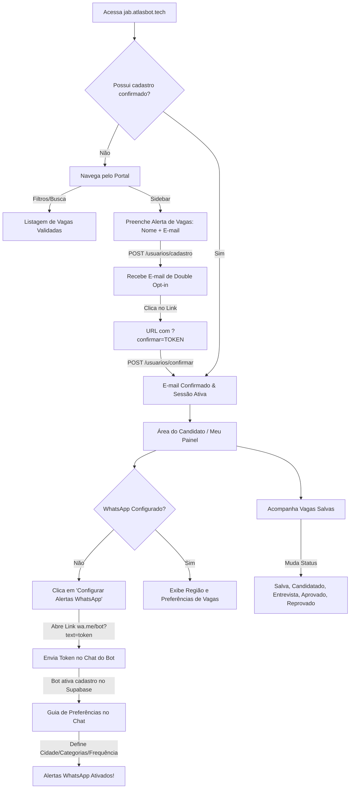
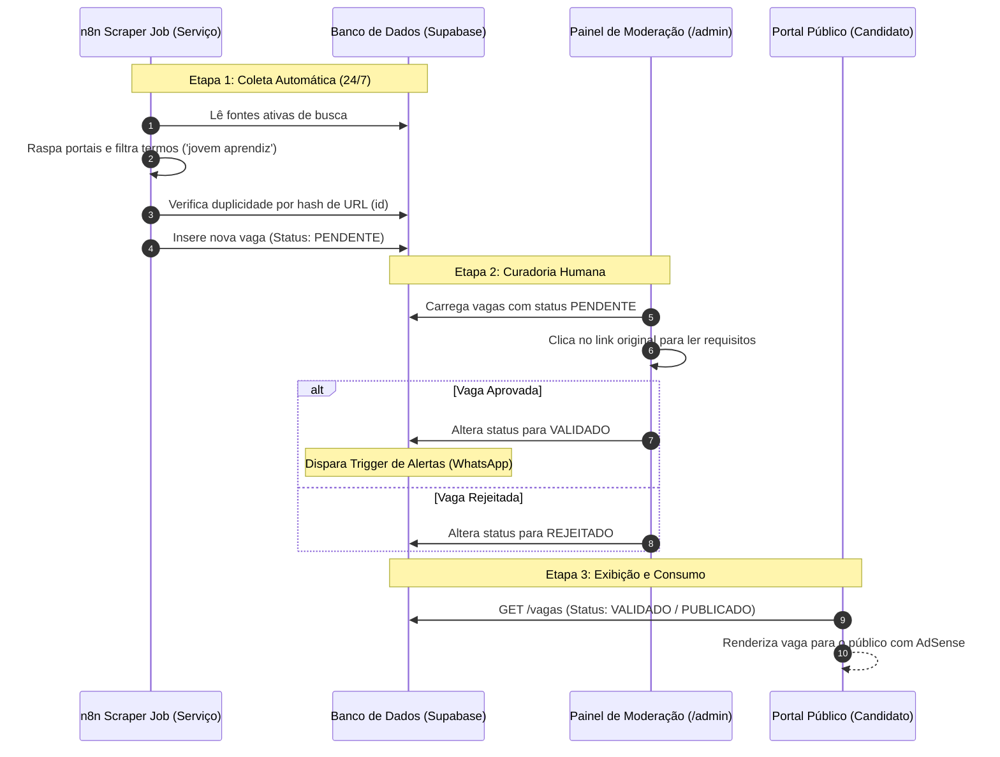
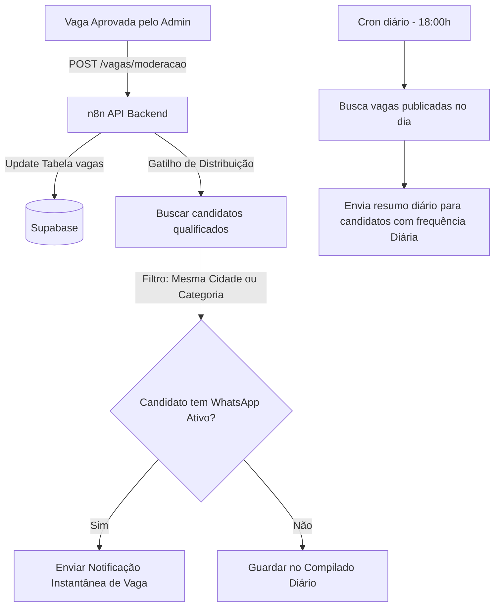

# Arquitetura de Fluxos — JAB (Portal de Vagas e Automação de Jovem Aprendiz)

Este documento mapeia o comportamento operacional do portal JAB. Ele detalha a navegação do usuário final, a interface de moderação administrativa, as rotas do frontend, a persistência de estados e as transições ponta a ponta integradas com a Camada de Serviços (n8n) e a Camada de Dados (Supabase).

---

## 🗺️ Mapa de Rotas e Telas (React SPA)

O portal é estruturado como uma Single Page Application (SPA) que gerencia cinco visualizações principais por meio do estado `currentRoute`:

| Rota (`currentRoute`) | Acesso | Descrição | Componente Principal |
| :--- | :--- | :--- | :--- |
| `portal` | Público | Página inicial com campo de busca por cargo/empresa/cidade, listagem de vagas validadas e formulário de inscrição em alertas. | `App.tsx` |
| `vaga` | Público | Detalhamento completo da vaga selecionada. Otimizada para SEO e carregamento de anúncios AdSense sem desarranjo de layout (anti-CLS). | [JobDetail.tsx](file:///c:/_GUARDAR/_ATLAS/JAB/src/components/JobDetail.tsx) |
| `guide` | Público | Guia "Comece por Aqui" composto por 8 slides interativos com quizzes para treinar candidatos a processos seletivos. | [Guide.tsx](file:///c:/_GUARDAR/_ATLAS/JAB/src/components/Guide.tsx) |
| `profile` | Privado | Painel do Candidato. Gerenciamento das candidaturas salvas e configuração regionalizada do Chatbot de WhatsApp. | [CandidateArea.tsx](file:///c:/_GUARDAR/_ATLAS/JAB/src/components/CandidateArea.tsx) |
| `admin` | Moderador | Painel administrativo local para triagem, aprovação e rejeição de vagas pendentes coletadas pelo robô scraper. | `App.tsx` & [AdminJobCard.tsx](file:///c:/_GUARDAR/_ATLAS/JAB/src/components/AdminJobCard.tsx) |

---

## 🔄 1. Fluxo de Navegação do Candidato (Ponta a Ponta)

O diagrama abaixo ilustra a jornada do jovem aprendiz no portal, desde a busca de vagas até o recebimento de alertas no WhatsApp.

### 💾 Persistência de Dados e Privacidade
*   **LocalStorage (`jab_candidate_applications`):** Salva as vagas que o usuário favoritou, notas de entrevistas e status individuais de candidatura. Os dados residem estritamente no navegador do candidato. Isso garante privacidade de dados (compliance LGPD) e zera o tráfego de requisições no servidor.
*   **LocalStorage (`jab_user_session`):** Mantém a sessão do usuário ativa e o token do candidato após o clique no link de Double Opt-in.
*   **Banco de Dados Central (Supabase):** Guarda os metadados de preferências de notificação (região, categorias, frequência e celular) na tabela `usuarios` para acionar os alertas automáticos de forma otimizada.

---

## 📥 2. Fluxo de Triagem e Moderação Administrativa

Este fluxo descreve o processo de captura automática de vagas pelo robô e a curadoria humana realizada pelo moderador antes da publicação online.

---

## ⚡ 3. Integração de Eventos e Gatilhos de Alerta

Quando uma vaga é aprovada no Painel de Moderação, a Camada de Serviços (n8n) executa a distribuição dos alertas:

### 🧠 Regras de Negócio Invioláveis do Alerta
1.  **Filtro por Localidade:** O robô do n8n lê a cidade e o estado informados pelo candidato durante o onboarding no WhatsApp e restringe os disparos para vagas da mesma região (ou que sejam "Remoto").
2.  **Controle de Spam:** Candidatos que configurarem a frequência como "Diária" não recebem mensagens instantâneas a cada aprovação de vaga; recebem um compilado único às 18:00h.
3.  **Opt-out Imediato:** Se o candidato digitar `SAIR` ou `CANCELAR` no WhatsApp, o bot altera o status de `whatsapp_configurado` para `false` no banco do Supabase de forma instantânea, bloqueando imediatamente novos envios.
