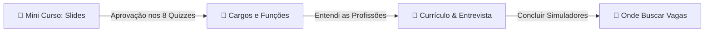

# Documentação Técnica — Guia Interativo "Comece por Aqui"

Este documento detalha o design, a arquitetura e as decisões de engenharia adotadas na implementação do Guia de Preparação de Carreira do Jovem Aprendiz ("Comece por Aqui") para o Portal JAB.

---

## 🎨 Conceito e Gamificação (UX/UI)

Em substituição ao antigo modelo de acordeões estáticos do WordPress, o novo guia adota uma estrutura de **Trilha Educacional Linear e Gamificada**. O objetivo é engajar os jovens candidatos por meio de micro-interações, reduzindo o volume excessivo de texto simultâneo e validando o conhecimento adquirido etapa por etapa.

### 🏆 Mecânica de Progresso Linear e Bloqueio Sucessivo
A navegação pelas abas do guia segue um fluxo sequencial rígido controlado por estado:



1.  **Etapa 1 (🏁 Mini Curso - Slides)**: Fica desbloqueada por padrão. O jovem acompanha 8 slides explicativos curtos. Cada slide possui uma pergunta de múltipla escolha correspondente (quiz).
2.  **Etapa 2 (💼 Cargos e Funções)**: Desbloqueada automaticamente após o jovem responder com sucesso a todos os 8 quizzes dos slides. Exibe uma grade interativa de cargos.
3.  **Etapa 3 (📝 Currículo & Entrevista)**: Liberada após o jovem ler sobre os cargos e clicar no botão de confirmação no rodapé da seção. Contém o manual de escrita de currículos e o simulador interativo de entrevistas.
4.  **Etapa 4 (🚀 Onde Buscar Vagas)**: Último nível liberado após a conclusão do simulador de entrevista e clique no botão de avanço no rodapé. Reúne links rápidos para portais externos e cursos gratuitos.

---

## 🛠️ Detalhes da Implementação de Código

A funcionalidade foi implementada em duas partes principais:

### 1. Componente React ([Guide.tsx](file:///c:/_GUARDAR/_ATLAS/JAB/src/components/Guide.tsx))
*   **Estado de Progresso**: `unlockedLevel` (número inteiro de 1 a 4) gerencia quais seções o usuário tem permissão para acessar.
*   **Controle do Menu de Abas**: Botões das abas bloqueadas recebem o prefixo de cadeado (`🔒`), classe CSS `.disabled` e a propriedade `disabled={true}`, prevenindo cliques antes da hora.
*   **Estrutura de Dados dos Slides**: Cada slide contém as propriedades abaixo para controle dinâmico de exibição:
    ```typescript
    interface Slide {
      title: string;
      emoji: string;
      description: string;
      bullets: string[];
      question: string;
      options: string[];
      correctAnswer: number;
    }
    ```
*   **Mecânica de Validação**: O botão de avançar o slide fica desativado até que `isCorrect === true`. A validação altera visualmente o botão da opção clicada (verde para acerto, vermelho para erro) e exibe feedbacks textuais contextualizados.
*   **Navegação e Scroll**: Ao clicar nos botões de rodapé para avançar as fases, a aplicação atualiza o `unlockedLevel`, troca a aba ativa e rola o navegador de volta para o topo da página com o método `window.scrollTo({ top: 0, behavior: 'smooth' })`.

### 2. Estilos Globais ([index.css](file:///c:/_GUARDAR/_ATLAS/JAB/src/index.css))
Adicionadas classes CSS Vanilla respeitando os design tokens da marca JAB:
*   `.guide-grid`: Divide a tela em duas colunas (280px para menu lateral de abas, e `1fr` para conteúdo principal).
*   `.guide-tabs-list`: Estiliza o contêiner vertical das abas (com efeito glassmorphism).
*   `.guide-tab-button.disabled`: Reduz a opacidade das abas travadas para `0.5`, esmaece a cor do texto e altera o cursor para `not-allowed`.
*   `.guide-slide-card`: Caixa central de slides centralizada, estruturada para alinhar emojis gigantes com animação `@keyframes pulse`.
*   `.guide-progress-bar`: Caixa de progresso no topo dos slides com preenchimento dinâmico em gradiente linear verde/azul.
*   `.guide-quiz-option`: Opções de resposta em formato de cartões táteis. Recebem borda verde/vermelha e fundos semânticos claros (`--color-success-bg` / `--color-error-bg`) dependendo do acerto ou erro.
*   `.guide-tab-action-container`: Área de rodapé dedicada aos botões de transição linear entre abas.

---

## 📱 Responsividade e Otimização Mobile

Implementamos regras minuciosas de mídia para assegurar que a interface permaneça limpa em qualquer viewport:

1.  **Menu de Abas Flexível (< 900px)**:
    O menu vertical de abas se transforma em uma barra de botões horizontal com `flex-wrap: wrap` e `flex: 1 1 auto`. Os botões ocupam o espaço disponível horizontalmente, permitindo uma alternância rápida com o polegar.
2.  **Abas Empilhadas (< 600px)**:
    Em telas muito pequenas de smartphones, as abas horizontais retornam à organização vertical clássica, otimizando o espaço de leitura.
3.  **Botões de Ação Adaptáveis**:
    *   No mobile, os botões de avanço de etapa e de congratulação passam de `width: auto` para `width: 100%`, gerando uma área de toque maior.
    *   A propriedade `white-space: normal` e `word-wrap: break-word` foi ativada em todos os botões de ação para permitir que o texto quebre de linha de forma elegante em celulares estreitos de 320px, evitando Cumulative Layout Shift (CLS) ou vazamentos horizontais.
